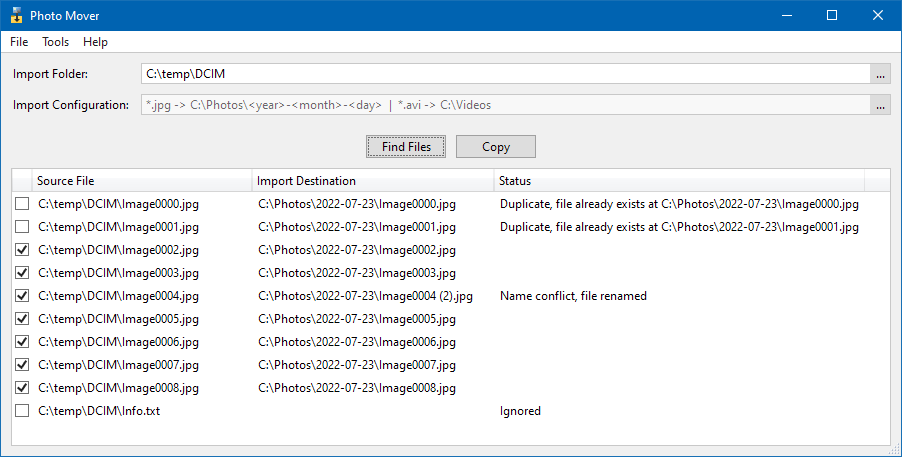
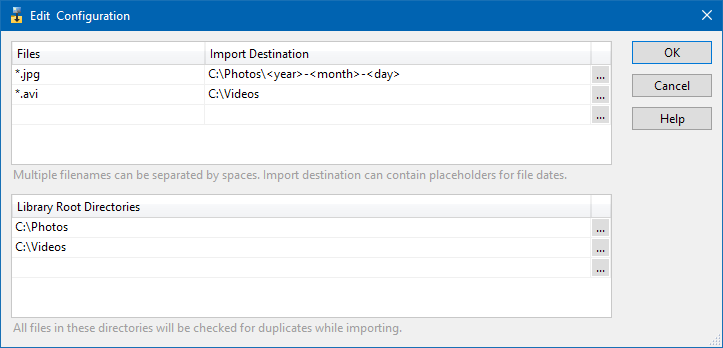
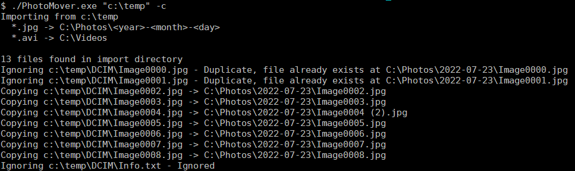

Photo Mover 2
===========

Organizes photos by exif data

### Download
Download latest version **[HERE](https://jonashertzman.github.io/PhotoMover2/download/PhotoMover.zip)**

### Features
- Highly customizable import configurations per file type.
- Import paths can be specified as any date format.
- Checks both import and existing libraries for duplicates.
- Command line support.
 
 ### Screen shots
  
*Main Window.*

  
*Import configuration.*

  
*Running the application in command line mode.*
